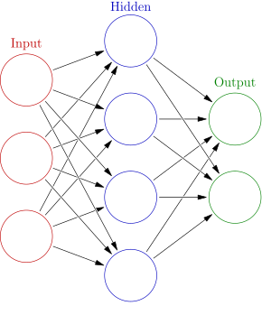

<h1 align="center">Neural Networks</h1>

<p align="center"><a href="https://en.wikipedia.org/wiki/Neural_network_(machine_learning)#:~:text=Typically%2C%20neurons%20are%20aggregated%20into,seemingly%20unrelated%20set%20of%20information."></img></a></p>

## Description:
**[TensorFlow](https://www.tensorflow.org/)** is a software library for machine learning and artificial intelligence. Including `model.evaluate()` in TensorFlow used to evluate a trained mode on a given dataset (returning loss value, additional metrics specific during model compilation).

## Notes:
#### Simple Linear Regression | [PyTorch](https://docs.pytorch.org/docs/stable/generated/torch.nn.Linear.html)
- Simple Linear Regression in PyTorch involves a standard machine learning workflow: defining the model, setting up the loss and optimizer, and running a training loop

#### MatplotLib | [3D Plotting](https://matplotlib.org/stable/gallery/mplot3d/index.html)
- **Matplotlib** was initially designed with only two-dimensional plotting; three-dimensional plots are enabled by importing the `mplot3d` toolkit, included with the main Matplotlib installation

#### TensorFlow | [ML / AI](https://www.tensorflow.org/)
- **TensorFlow** is a software library for machine learning and artificial intelligence. It can be used across a range of tasks, but is used mainly for training and inference of neural networks. **[.npy](https://numpy.org/devdocs/reference/generated/numpy.lib.format.html)** format is the standard binary file format in NumPy for persisting a single arbitrary NumPy array on disk.
```
pip install --upgrade tensorflow
pip install ipykernel
```

- [Sequential Model](https://www.tensorflow.org/guide/keras/sequential_model) is appropriate for a plain stack of layers where each layer has exactly one input tensor and one output tensor.
    - Output = np.dot(inputs, weights) + bias
    - Module: [tf.keras.losses](https://www.tensorflow.org/api_docs/python/tf/keras/losses) Built-in loss functions.
    - Module: [tf.keras.layers.Dense](https://www.tensorflow.org/api_docs/python/tf/keras/layers/Dense) implements the operation: `output = activation(dot(input, kernel) + bias)` where `activation` is the element-wise activation function passed as the `activation` argument, `kernel` is a weights matrix created by the layer, and bias is a bias vector created by the layer (only applicable if `use_bias` is `True`).
    - [NumPy Neural Network](https://github.com/jldbc/numpy_neural_net) simple multilayer perceptron implemented from scratch in pure Python and NumPy.
 
```
import tensorflow as tf
import keras
from keras import layers
```
- [Deep Neural Network](https://en.wikipedia.org/wiki/Neural_network_(machine_learning)) has at least two hidden layers.
    - [Hyperparmeters](https://en.wikipedia.org/wiki/Hyperparameter_(machine_learning)) is a parameter that can be set in order to define any configurable part of a model's learning process: Width, Depth, Learning Rate
    - [Parameters](https://medium.com/analytics-vidhya/what-are-model-parameters-in-deep-learning-and-how-to-calculate-it-de96476caab) are the learned values within a machine learning model that determine how it maps input data to outputs, such as generated text or a predicted classification
- **Linear Combinations**: Input, Hidden Layer (n), Output Layer 
    - [Activation Functions](https://www.datacamp.com/tutorial/introduction-to-activation-functions-in-neural-networks) are an integral building block of neural networks that enable them to learn complex patterns in data.

- [Backpropagation in Neural Network](https://www.geeksforgeeks.org/machine-learning/backpropagation-in-neural-network) short for Backward Propagation of Errors, is a key algorithm used to train neural networks by minimizing the difference between predicted and actual outputs.
    - **Dataset**: Training, Validation, Test
    ```
    training_data = np.load('TF_intro.npz')
    ```
    - **[Callback](https://www.tensorflow.org/api_docs/python/tf/keras/callbacks/Callback)** can be passed to keras methods such as `fit()`, `evaluate()`, and `predict()` in order to hook into the various stages of the model training, evaluation, and inference lifecycle.

- [Gradient Descent: Batch, Stochastic, and Mini-Batch Methods](https://medium.com/@chaudharyankita667/understanding-gradient-descent-batch-stochastic-and-mini-batch-methods-9867829e90f4) are one of the most important optimization algorithms in machine learning and deep learning.
    - **Batch Gradient Descent (BGD)** it processes the entire dataset to calculate a single update to the model parameters
    - **Stochastic Gradient Descent (SGD)** is a variant of gradient descent that makes updates to the model parameters after each individual training sample
    - **Mini-Batch Gradient Descent** is a compromise between Batch Gradient Descent and Stochastic Gradient Descent. It splits the training dataset into smaller batches, and then it computes the gradient and updates the parameters using these smaller batches
    ```
    tf.keras.layer.Dense(output size)
    ```
    - takes the input, provided to the model and calculates the dot product of the input and the weights and adds the bias. This is also where we can apply to an activated function. 

[CNN](https://en.wikipedia.org/wiki/Convolutional_neural_network) (Convolutional Neural Networks) and [RNNs](https://en.wikipedia.org/wiki/Recurrent_neural_network) (Recurrent Neural Networks) are both **Deep Learning Networks**. 
    
    - Input Layer -> Convolution Layer -> Pool Layer
    - [Preprocessing Data](https://scikit-learn.org/0.19/modules/preprocessing.html#:~:text=4.3.-,Preprocessing%20data,scalers%20on%20data%20with%20outliers.) package provides several common utility functions and transformer classes to change raw feature vectors into a representation that is more suitable for the downstream estimators

## Resources:
- [NumPy](https://numpy.org/) The fundamental package for scientific computing with Python
- [Matplotlib: Visualization with Python](https://matplotlib.org/) comprehensive library for creating static, animated, and interactive visualizations in Python. Matplotlib makes easy things easy and hard things possible.
- [Pandas](https://pandas.pydata.org/) The fundamental package for scientific computing with Python:
    - **Column Names in Pandas Dataframe** operations included in [link](https://www.geeksforgeeks.org/python/how-to-get-column-names-in-pandas-dataframe/); DataFrame is often abbreviated as `df` when using pandas `pd`


## Contact:
<!--- You can add in your linkedin, medium, stack overflow, dev.to account, etc. here --->
If you want to contact me you can reach me at <nelson@oakhalo.com>.

Connect with me on <a href="https://www.linkedin.com/in/ayla-nelson/">LinkedIn</a>

Connect with me on <a href="https://github.com/oakHalo">Oakhalo.dev</a>

<!-- 
### TODO stx: 
Future Structure (stx):
backend
frontend
images
screenShots [contains video link]
troubleShooting [contains issues resolved]
-->
