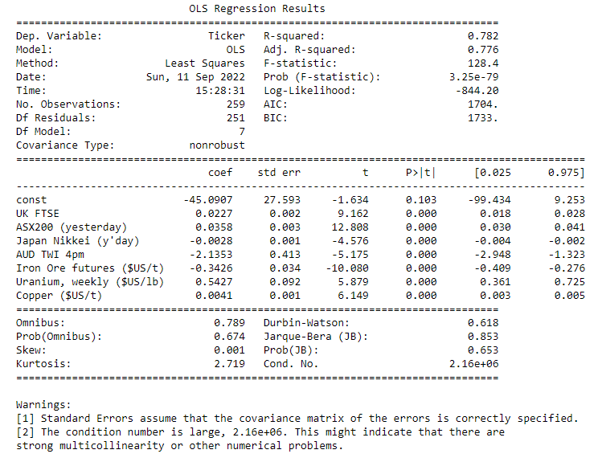
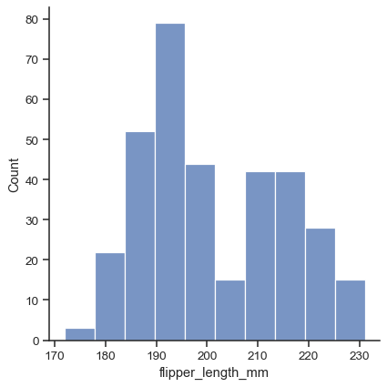
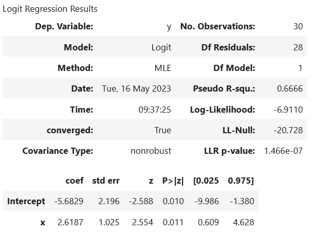

<h1 align="center">Data Science Toolkit</h1>

<p align="center"><a href="https://blackbird.ai/"></img></a></p>


## Description:
**Data Science** using Python expanding on the pandas and NumPy sections with smaller, unique datasets

## Notes:
#### ML in Python | [SciKit](https://scikit-learn.org/stable/)
- Simple and efficient tools for predictive data analysis: Regression, Classification, Clustering, Support Vector Machines, Dimensionality Reduction
- Built on [NumPy](https://numpy.org/), [SciPy](https://scipy.org/), [pandas](https://pandas.pydata.org/) and [matplotlib](https://matplotlib.org/)
- Linear Model: 
    
    Import the relevant Libraries
    ```
    import numpy as np
    import pandas as pd
    import matplotlib.pyplot as plt
    important seaborn as sns
    sns.set()

    from sklearn.linear_model import LinearRegression
    ```
    Load the data (`read_csv()`)
    ```
    data = pd.read_csv("1.01. Simple Linear Regression.cvs")
    data.head()
    ```
    Create the Regression
    ```
    x = data["col1"]
    y = data["col2"]
    x.shape
    y.shape

    x_matrix = x.values.reshape(-1, 1)
    x_matrix.shape
    ```
    Regression Itself
    ```
    reg = LinearRegression()
    reg.fit(x_matrix,y)
    ```
    [R-squared](https://en.wikipedia.org/wiki/Coefficient_of_determination) - Coefficient of Determination
    ```
    reg.score(x_matrix, y)
    ```
    Co-efficients
    ```
    reg.coef_
    ```
    Intercept
    ```
    reg.intercept_
    ```
    Making Predictions
    ```
    reg.predict(<number>)
    ```
    Regression Model Summary from [Scikit-Learn](https://www.geeksforgeeks.org/python/how-to-get-regression-model-summary-from-scikit-learn/) INPUT:
    ```
    # import packages
    import numpy as np
    import pandas as pd
    import statsmodels.formula.api as smf

    # loading the csv file
    df = pd.read_csv('headbrain1.csv')
    print(df.head())

    # fitting the model
    df.columns = ['Head_size', 'Brain_weight']
    model = smf.ols(formula='Head_size ~ Brain_weight',
                    data=df).fit()

    # model summary
    print(model.summary())
    ```
    Regression Model Summary from [Scikit-Learn](https://www.geeksforgeeks.org/python/how-to-get-regression-model-summary-from-scikit-learn/) OUTPUT:
    <p align="center"><a href="https://scikit-learn.org/stable/modules/generated/sklearn.linear_model.LinearRegression.html"></img></a></p>
    **P > |t|** if a variable as a p-value > 0.05, we can disregard it

    Creating a Summary Table: Features, Coefficients, P-values
    ```
    reg_summary = pd.DataFrame(data = x.columns.values, columns=['Features'])
    reg_summary
    ```

    Standardization
    ```
    from sklearn.preprocessing import StandardScaler
    scaler = StandardScaler()
    scaler.fix(x)
    x_scaled = scaler.transform(x)
    ```
- [Seaborn](https://seaborn.pydata.org/generated/seaborn.displot.html) several approaches for visualizing the univariate or bivariate distribution of data, including subsets of data defined by semantic mapping and faceting across multiple subplots
```
penguins = sns.load_dataset("penguins")
sns.displot(data=penguins, x="flipper_length_mm")
```
<p align="center"><a href="https://seaborn.pydata.org/generated/seaborn.displot.html"></img></a></p>

- [Underfitting](https://www.ibm.com/think/topics/underfitting) the model has no captured the underlying logic of the data
- [Overfitting](https://www.ibm.com/think/topics/overfitting) Our Training has focused on the particular training set so much, it has "missed the point" 
- [Variance Inflation Factor (VIF)](https://gustavorsantos.medium.com/calculating-variance-inflation-factor-vif-in-python-49e5f48f33bf) is a metric used to quantify the severity of multicollinearity among independent variables in a regression model

- [Maximum likelihood estimation - MLE](https://en.wikipedia.org/wiki/Maximum_likelihood_estimation) is a method of estimating the parameters of an assumed probability distribution, given some observed data.
<p align="center"><a href="https://towardsdatascience.com/logistic-regression-deceptively-flawed-2c3e7f77eac9/"></img></a></p>
- LL-Null (log likelihood-null): the log-likelihood of a model which has no indepedent variables. 


- [Feature Scaling](https://en.wikipedia.org/wiki/Feature_scaling) is a method used to normalize the range of independent variables or features of data
- Differences between the L1-norm and the L2-norm [Least Absolute Deviations and Least Squares](https://www.chioka.in/differences-between-the-l1-norm-and-the-l2-norm-least-absolute-deviations-and-least-squares/) 


#### AI Applications | [MCP - Model Context Protocol](https://modelcontextprotocol.io/docs/getting-started/intro)
- Generation information from the speaker here

## Resources:
- R Studio is preferred by Biologist for Visualizing Data:
    - **[ggplot2](https://ggplot2.tidyverse.org/)** is a system for declaratively creating graphics
    - [RStudio](https://github.com/rstudio) Github with [CheatSheets](https://github.com/rstudio/cheatsheets/blob/main/data-visualization.pdf)
- [Pandas](https://pandas.pydata.org/) is an essential, open-source Python library designed for high-performance data manipulation and analysis:
    - [pandas.get_dummies](https://pandas.pydata.org/docs/reference/api/pandas.get_dummies.html) Convert categorical variable into dummy/indicator variables.
- [Logit](https://en.wikipedia.org/wiki/Logit) function is the quantile function associated with the standard logistic distribution
- [Classification](https://scikit-learn.org/stable/auto_examples/classification/index.html) predicting an output category, given an input data
- [Clustering](https://scikit-learn.org/stable/modules/clustering.html) Grouping data points toether based on similarities among them and difference from others by [Google](https://developers.google.com/machine-learning/clustering/clustering-algorithms)
    - [K-Means](https://www.ibm.com/think/topics/k-means-clustering) Clusterings that are FLAT example: 
    ```
    class sklearn.cluster.KMeans(n_clusters=8, *, init='k-means++', n_init='auto', max_iter=300, tol=0.0001, verbose=0, random_state=None, copy_x=True, algorithm='lloyd')12
    ```
    - [HIERACHICAL](https://en.wikipedia.org/wiki/Hierarchical_clustering) subdivides into [AGGLORMERATIVE](https://scikit-learn.org/stable/modules/generated/sklearn.cluster.AgglomerativeClustering.html) Bottom-Up often using Dendrogram and [DIVISIVE](https://scikit-learn.org/stable/auto_examples/cluster/plot_ward_structured_vs_unstructured.html) Top-Down
    - Heatmaps in [seaborn](https://seaborn.pydata.org/generated/seaborn.clustermap.html)
- [Supervised Learning](https://scikit-learn.org/stable/supervised_learning.html) a machine learning technique where an algorithm is trained on labeled data

ChatGPT for Data Science


## Contact:
<!--- You can add in your linkedin, medium, stack overflow, dev.to account, etc. here --->
If you want to contact me you can reach me at <nelson@oakhalo.com>.

Connect with me on <a href="https://www.linkedin.com/in/ayla-nelson/">LinkedIn</a>

Connect with me on <a href="https://github.com/oakHalo">Oakhalo.dev</a>

<!-- 
### TODO stx: 
Future Structure (stx):
backend
frontend
images
screenShots [contains video link]
troubleShooting [contains issues resolved]
-->
